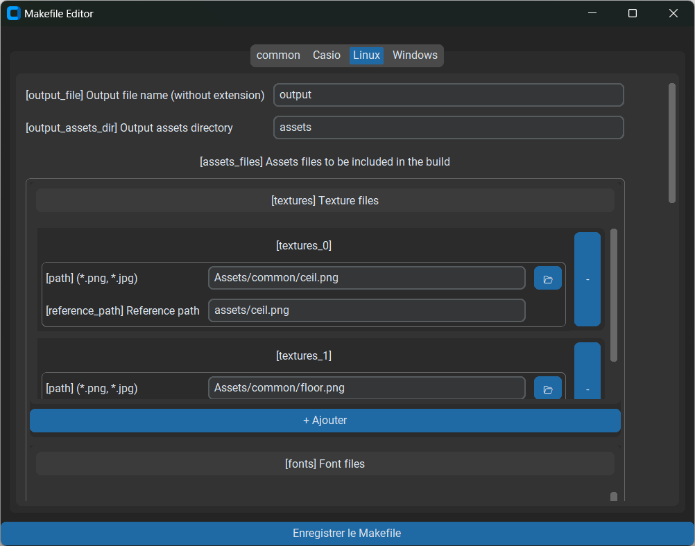

# 🛠️ ParticuleCraftUI

`ParticuleCraftUI` est une **interface graphique** pour créer ou modifier un Makefile JSON compatible avec le système de compilation **ParticuleCraft**.

Il permet d’éditer visuellement les variables de configuration propres à chaque distribution (Windows, Linux, Casio, etc.), en s’appuyant automatiquement sur les fichiers de configuration de chaque distribution.

---

## 🎯 Objectif

Simplifier la génération d’un Makefile `.json` sans passer par l’édition manuelle du fichier texte.

---

## 💡 Fonctionnement général

- À l’ouverture de l’application, deux options sont proposées :
  - **Importer un Makefile existant**
  - **Créer un nouveau Makefile**
- Une fois l’option choisie, l’interface affiche dynamiquement tous les champs de configuration nécessaires à chaque distribution.
- Chaque champ est éditable via des **inputs clairs** (textes, listes, fichiers, booléens…).
- Un bouton **"Enregistrer le Makefile"** en bas permet de sauvegarder toutes les modifications.

---

## 📷 Aperçu de l’interface

Dans cet exemple, la distribution Linux est sélectionnée.
On peut y définir :
- Le nom du fichier de sortie `[output_file]`
- Le dossier des assets `[output_assets_dir]`
- Les assets de type `textures`, `fonts`, etc., chacun avec une interface permettant :
  - D’ajouter des fichiers
  - De spécifier des chemins de référence
  - De supprimer des entrées

---

## ✅ Avantages

- Interface intuitive même pour les débutants
- Évite les erreurs de format dans les fichiers `.json`
- S’adapte automatiquement aux distributions disponibles
- Permet de créer rapidement un projet sans ligne de commande