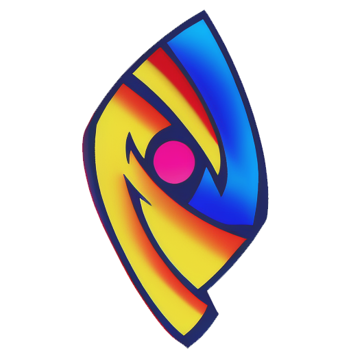

<h1>Particule SDK</h1>

**Particule SDK** est un **ensemble complet d'outils et de bibliothèques** destiné au développement d’applications multiplateformes (PC, consoles, calculateurs, etc.) basé sur le moteur **Particule Engine**. Il vise à offrir une solution simple, modulaire et extensible, parfaitement adaptée aux environnements à faible puissance, aux projets embarqués, ou aux applications performantes et portables.

---

## ✨ Qu’est-ce que Particule Engine ?

**Particule Engine** est un moteur de jeu minimaliste et modulaire, développé en C++, qui fournit les bases fondamentales pour le rendu, l’audio, les entrées utilisateur, les assets, et bien plus. Il est conçu pour s’adapter à **plusieurs plateformes**, avec une gestion spécifique par distribution (Windows, Linux, Casio, etc.). Particule Engine est fortement inspiré de l’architecture d’Unity 3D.

---

## 🧰 Que contient Particule SDK ?

Le SDK inclut :

* 📦 **ParticuleCore** : le cœur du moteur, commun à toutes les plateformes.

* 🏗️ **ParticuleCraft** : un système de compilation basé sur `Makefile.json`, qui fusionne automatiquement les configurations spécifiques de chaque distribution.

* 🧪 **ParticuleTools** : des outils de développement pratiques (éditeur de sprites, éditeur graphique de Makefile, etc.).

* 📚 Une **documentation complète** accessible localement.

* ⚙️ Un **installateur graphique** pour simplifier la mise en place de l’environnement.

---

## 🚀 Démarrer avec Particule SDK

### 1. 📥 Installation du SDK

Particule SDK inclut un **installateur graphique** (Windows/Linux) pour vous guider pas à pas :

> 🔗 Consultez la procédure détaillée dans [`Installation`](ParticuleTools/Documentation/static/docs/installation.md)

Cela installera automatiquement les dépendances, configurera un environnement virtuel.

---

### 2. 📚 Documentation

Une documentation claire et dynamique est incluse :

```bash

python ParticuleTools/Documentation/app.py  #puis ouvrez docs/index.html dans votre navigateur

```

> La documentation comprend :
>
> * Une [page d’introduction](ParticuleTools/Documentation/static/docs/introduction.md)
> * Un [guide de démarrage rapide](ParticuleTools/Documentation/static/docs/guide-demarrage.md)
> * Des pages détaillées pour chaque module

---

### 3. 🔧 Installer une distribution

Une fois le SDK installé, utilisez **ParticuleCraft** pour gérer vos plateformes :

```bash

ParticuleCraft install --target Windows

```

D'autres commandes disponibles : `update`, `build`, `create`, `clean`, etc.

---

## 🛠️ Exemples d’outils fournis

* 🎨 **Sprite Editor** : éditeur graphique de sprites + export

* 🧾 **ParticuleCraftUI** : interface graphique pour modifier un `Makefile.json`

* 📜 Aliases Bash/Powershell intégrés pour accès rapide aux outils

---

## 🤝 Contribuer

Le projet est encore en développement. Vous pouvez contribuer, suggérer des améliorations ou rapporter des bugs en ouvrant une issue ou une pull request.

---

## 🧠 Philosophie du projet

* 🔬 **Optimisé** : orienté bas niveau

* ⚖️ **Portable** : même code source pour plusieurs distributions

* 🧩 **Extensible** : ajout de nouvelles plateformes ou modules facile

---

## 📄 Licence

Projet sous licence MIT – utilisez, modifiez, contribuez librement.
